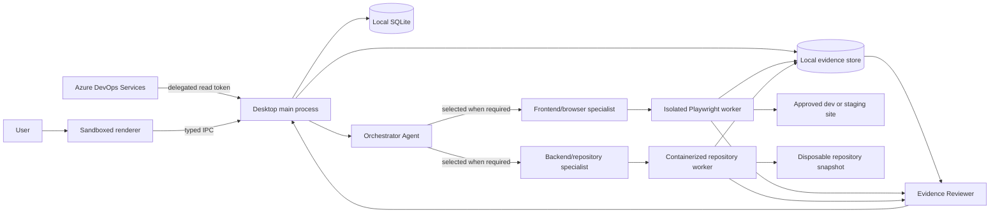

# Agentic QA: desktop architecture

**Status:** implementation baseline, 2026-09-27. Electron is the provisional v1 shell choice; M0 comparison and Windows runtime validation remain open.

## Architecture decision

Use **Electron + React + TypeScript** for the packaged Windows/macOS UI and orchestration, **SQLCipher-backed SQLite** for encrypted local metadata, **Playwright Test** for browser checks, and a containerized worker for repository commands. The desktop app is the trust boundary and coordinator; the renderer is a presentation layer with a narrow typed IPC bridge. No web service, Postgres, Redis, or Azure hosting is required for the first release. Validate SQLCipher's native packaging on both platforms during M0. [SQLCipher overview](https://www.zetetic.net/sqlcipher/).

Every QA run requires a configured provider-backed agent. The main-process Orchestrator interprets selected Requirements, Tasks, acceptance criteria, targets and bounded repository context; it creates a versioned plan and delegates to structured frontend and backend specialist calls selected for the work. Specialists generate Playwright scenarios or repository tests; ordinary app code routes those validated outputs to existing isolated workers. After execution, a Reviewer Agent examines bounded approved source, generated test code and direct observations, then returns criterion-linked summaries and code-review notes. The user approves a run-level context/permission and budget envelope once; agent calls stay within it. Provider credentials remain in encrypted main-process storage. Worker capabilities, evidence validation and verdict policy stay app-owned; agents cannot add capabilities, execute arbitrary shell, modify the source tree, or set verdicts. The current implementation does not provide a general multi-turn agent tool loop.

## Why this stack

| Option | Strength | Cost / reason for decision |
|---|---|---|
| Electron + TypeScript (selected) | One main language for UI, ADO client, orchestration and Playwright; mature Windows/macOS packaging | Larger installer and strict renderer hardening needed |
| Tauri + Rust + TypeScript | Smaller shell and granular capabilities | A separate Node/Playwright runtime is still needed; Rust/JS bridge adds packaging complexity |
| Python service + browser UI | Strong Python test ecosystem; simple hosted growth | Local desktop distribution becomes a sidecar/service packaging problem; conflicts with first-release UX |

The implementation proceeds with Electron because the selected authentication, database, ADO, UI, and Playwright orchestration stack is Node/TypeScript; a Tauri build would still need to package the Node/Playwright runtime and bridge it to Rust. This is a provisional engineering decision, not a completed comparative probe. Local evidence now includes a macOS arm64 packaged launch and cross-built unsigned Windows x64 installer and portable executable, with Windows runtime still unverified. Installer size is about 123 MiB. A measured Tauri comparison, Windows launch, browser install, auth callback, idle/runtime memory, antivirus friction, and crash cleanup remain M0 evidence. See [ADR-0003](decisions/ADR-0003-provisional-electron-stack.md) and the [M0 record](spec/08-m0-feasibility-record.md).

## Runtime modules and interfaces

| Module | Responsibility | Public contract |
|---|---|---|
| Desktop renderer | ADO-branded onboarding, organization/project picker, Work items, QA Queue, Runs and Settings | Typed commands/events only; no token, filesystem, shell or unrestricted network access |
| ADO adapter | Sign-in, discover accessible orgs/projects, query/fetch work items and relations, optional linked PR metadata | Normalized `RequirementSnapshot` and `TaskSnapshot` |
| Orchestrator Agent | Interpret selected work and target context; create coverage/delegation plan; dispatch typed tool requests | Versioned `DelegationPlan`; agent does not define capabilities or verdict |
| Provider adapters | Discover compatible models and normalize structured outputs/tool calls; stream bounded response text to the local renderer when supported | `ProviderModel`, `AgentRequest`, `AgentResponse`, reported usage and typed model-response events |
| Capability broker | Validate each model tool request against approved context, tool catalog and budgets | Typed operation result; no arbitrary shell, filesystem or network API |
| Repository specialist/worker | Inspect selected immutable snapshot; review code; draft tests; run reviewed commands in disposable copy | Structured repo observations, test output and artifact references |
| Frontend/browser specialist/worker | Draft and execute bounded Playwright checks against approved origin | Structured browser observations, screenshots and trace references |
| Reviewer Agent | Associate results with criteria, explain classifications and identify proof gaps | Evidence-linked summaries and code notes; validated medium/high coverage notes can only create unresolved `INSUFFICIENT_EVIDENCE` findings through deterministic app policy |
| Report assembler | Apply evidence/verdict policy and render diagram/results to HTML/Markdown/JSON | Immutable `QAReport` plus plan-specific delegation diagram |
| Report assembler | Apply deterministic verdict policy, generate HTML/Markdown/JSON export | Immutable `QAReport` |
| Local store | Persist queue, settings, run snapshots, metadata and artifact index | Versioned SQLite schema and evidence directory |

Keep source tracker fields and AI provider messages out of the core QA domain. Adapters convert them to stable contracts. Every observation cites a run, source revision, scenario, worker and artifact or assertion result.

## Run data flow

1. On first launch, the user selects **Sign in with Azure DevOps**; Azure CLI opens Microsoft sign-in in the system browser. The app uses the CLI's Entra-backed ADO token in the main process. The user chooses or imports a saved organization/project/team/board-column/Story profile, then queues one or more requirements or tasks.
2. The app fetches current work item revisions, child relations, acceptance criteria and Task fields with source provenance. Repository selection freezes an immutable snapshot; the user can reject a stale or ambiguous item.
3. The user selects `repository`, `site`, or `both`, then configures target-specific permissions and scope.
4. Before saving or retesting a model, the app explains that the fixed minimal prompt contains no project data and may incur provider charges; Claude plan allowance use is disclosed. The save action waits for this prompt check and records the result. Before sending selected work-item context for plan synthesis, the app shows the selected tested provider/model and exact ADO IDs/revisions/fields. The user explicitly approves this bounded plan-preparation request. Plan Review then presents the run permission envelope, including worker capabilities, repository paths, site origin, commands and budgets; final run approval is required before workers start. There is no provider-free QA run mode.
5. The Orchestrator analyzes source criteria and Tasks, identifies code/UI/API test layers, and creates a versioned delegation plan. A Task may suggest scope but cannot become source truth for its parent criterion. A diagram is generated from the validated assignments.
6. The Orchestrator invokes selected repository/browser specialists. The capability broker exposes only approved typed tools; agents can inspect the selected snapshot, generate tests in a disposable copy, invoke reviewed command IDs, and use Playwright on the approved origin. Scope/budget expansion pauses for approval.
7. Workers write observations and encrypted evidence to the run. Reviewer Agent links results to criteria, calls out missing proof and reviews generated test coverage. The app validates result/evidence references; medium/high coverage concerns can only downgrade a criterion to `NEEDS_REVIEW` through an unresolved `INSUFFICIENT_EVIDENCE` finding. AI assertions cannot create proof or `PASS`.
8. The user reviews and exports the report, actual delegation diagram, summaries and evidence. A new run creates a new manifest; prior reports are not silently rewritten.

## Execution boundaries

- The renderer uses `contextIsolation`, sandboxing, disabled Node integration, a restrictive CSP, validated IPC senders and denied unexpected navigation. The app loads only packaged UI content. [Electron security checklist](https://www.electronjs.org/docs/latest/tutorial/security).
- Azure CLI owns Microsoft sign-in and its credential cache. The app calls a fixed CLI executable with argument arrays, holds ADO access tokens only in main-process memory, and never passes them to renderer or workers. Account-scoped run profiles are stored in encrypted local settings. Provider and target credentials use operating-system-backed encryption.
- Repository code, package scripts and generated tests are untrusted. A run uses a disposable copy in a constrained container with no Docker socket, no privileged mode, no host secrets, a non-root user, resource/time limits, a narrow mount set, and explicit network policy. Containers reduce risk but are not a perfect security boundary. [Docker Engine security](https://docs.docker.com/engine/security/).
- Site QA is restricted to explicitly allowed origins and test accounts. Redirects, downloads, uploads, state-changing flows and external hosts follow the policy in [security and privacy](spec/04-security-privacy.md).
- The coordinator owns hard caps: provider calls, token/cost reservations, agent count/fan-out, concurrency, wall time, browser actions, repository commands, artifact size and retries. Unknown model pricing is a preflight block. An agent cannot raise its own limits or expand its tools.

## Local storage

SQLCipher-backed SQLite stores accounts by opaque ID, validated organizations and run profiles (organization, project, team, board column and Story IDs) per account, selected organization/project, queue, target configuration, contracts, run manifests, observations, artifact index and report summary. A random database key is wrapped by an OS-backed facility; SQLite contains only secret references. Evidence is encrypted after collection under an app-owned per-run directory with per-artifact authenticated encryption. Worker scratch may hold plaintext during execution and must be isolated, access-restricted and removed afterward; full-disk encryption is recommended for stronger protection of temporary files. Deleting a run removes its database rows and evidence files. Export requires explicit user action and excludes credentials.

## Platform and distribution

For v1 local testing, produce a launchable unsigned Windows `.exe` and macOS app; code signing/notarization is outside this release scope and the OS may show a trust warning. Verify install, upgrade, rollback, auth callback, browser runtime installation and container preflight on both platforms. Browser-only use must not require a container. Repository execution requires a supported container runtime; if unavailable, the app explains the limitation and can still run site QA. Revisit signing before broad public distribution. [Electron distribution guidance](https://www.electronjs.org/docs/latest/tutorial/distribution-overview).

## Later hosted evolution

ADO webhooks require a public HTTPS endpoint, so automatic PR/work-item triggers are a later hosted capability, not a feature of a machine that may be offline. Shared storage, centralized secrets, multi-user RBAC and hosted workers need a separate threat model and migration plan. [ADO webhook requirements](https://learn.microsoft.com/en-us/azure/devops/service-hooks/services/webhooks?view=azure-devops).
