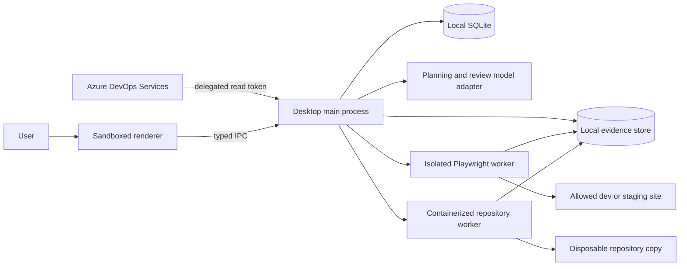

# Agentic QA: desktop architecture

**Status:** implementation baseline, 2026-09-27. Electron is the provisional v1 shell choice; M0 comparison and Windows runtime validation remain open.

## Architecture decision

Use **Electron + React + TypeScript** for the packaged Windows/macOS UI and orchestration, **SQLCipher-backed SQLite** for encrypted local metadata, **Playwright Test** for browser checks, and a containerized worker for repository commands. The desktop app is the trust boundary and coordinator; the renderer is a presentation layer with a narrow typed IPC bridge. No web service, Postgres, Redis, or Azure hosting is required for the first release. Validate SQLCipher's native packaging on both platforms during M0. [SQLCipher overview](https://www.zetetic.net/sqlcipher/).

The optional model adapter sends only selected browser acceptance-criteria text to the fixed OpenAI Responses endpoint after a separate exact-payload preview approval. No request is made in local-only planning. Provider keys stay in encrypted main-process storage; tokens and raw secrets never enter model prompts. The model only proposes schema-validated, unapproved browser scenarios. The QA engine remains deterministic for ingestion, existing tests, artifact capture, report assembly, and status calculation.

## Why this stack

| Option | Strength | Cost / reason for decision |
|---|---|---|
| Electron + TypeScript (selected) | One main language for UI, ADO client, orchestration and Playwright; mature Windows/macOS packaging | Larger installer and strict renderer hardening needed |
| Tauri + Rust + TypeScript | Smaller shell and granular capabilities | A separate Node/Playwright runtime is still needed; Rust/JS bridge adds packaging complexity |
| Python service + browser UI | Strong Python test ecosystem; simple hosted growth | Local desktop distribution becomes a sidecar/service packaging problem; conflicts with first-release UX |

The implementation proceeds with Electron because the selected authentication, database, ADO, UI, and Playwright orchestration stack is Node/TypeScript; a Tauri build would still need to package the Node/Playwright runtime and bridge it to Rust. This is a provisional engineering decision, not a completed comparative probe. Local evidence now includes a macOS arm64 packaged launch and cross-built unsigned Windows x64 installer and portable executable, with Windows runtime still unverified. Installer size is about 123 MiB. A measured Tauri comparison, Windows launch, browser install, auth callback, idle/runtime memory, antivirus friction, and crash cleanup remain M0 evidence. See [ADR-0003](decisions/ADR-0003-provisional-electron-stack.md) and the [M0 record](spec/08-m0-feasibility-record.md).

## Runtime modules and interfaces

| Module | Responsibility | Public contract |
|---|---|---|
| Desktop renderer | ADO-branded onboarding, organization/project picker, Work items, QA Queue, Runs and Settings | Typed commands/events only; no token, filesystem, shell or unrestricted network access |
| ADO adapter | Sign-in, discover accessible orgs/projects, query/fetch work items and relations, optional linked PR metadata | Normalized `RequirementSnapshot` and `TaskSnapshot` |
| QA planner | Turn snapshots into reviewable criteria, scenarios and required evidence | Versioned `QAContract`; never executable commands |
| Run coordinator | Validate preflight, freeze inputs, enforce budgets, dispatch workers, handle cancellation | `RunManifest`, state transitions, `Observation[]` |
| Repo worker | Inspect disposable snapshot, run configured existing tests, eventually generated tests | Structured command results and artifact references |
| Browser worker | Execute Playwright checks against allowlisted site; record assertions and traces | Structured browser observations and artifact references |
| Reviewer | Map observations to criteria and classify failures/gaps | Evidence citations, confidence notes, suggested follow-ups |
| Report assembler | Apply deterministic verdict policy, generate HTML/Markdown/JSON export | Immutable `QAReport` |
| Local store | Persist queue, settings, run snapshots, metadata and artifact index | Versioned SQLite schema and evidence directory |

Keep source tracker fields and AI provider messages out of the core QA domain. Adapters convert them to stable contracts. Every observation cites a run, source revision, scenario, worker and artifact or assertion result.

## Run data flow

1. On first launch, the user selects **Sign in with Azure DevOps**; Azure CLI opens Microsoft sign-in in the system browser. The app uses the CLI's Entra-backed ADO token in the main process. The user chooses or imports a saved organization/project/team/board-column/Story profile, then queues one or more requirements or tasks.
2. The app fetches current work item revisions, child relations, relevant fields and explicitly selected PR/repo context. The user can reject a stale or ambiguous item.
3. The user selects `repository`, `site`, or `both`, then configures target-specific permissions and scope.
4. The app creates a local deterministic draft. If optional scenario suggestions are requested, it shows the exact selected-criteria payload and token limits and waits for a separate approval before calling OpenAI. The model can suggest scenarios only; the user edits and approves the contract. Empty or contradictory criteria remain visible as `NEEDS_REVIEW` candidates.
5. Preflight verifies auth, paths, reachable URL, container readiness when needed, browser installation, model availability, budgets and storage. If execution/review would transmit additional context beyond the approved disclosure, the app presents another preview and waits for approval.
6. The coordinator freezes a `RunManifest` with ADO IDs/revisions, source commit or content snapshot hash, site URL, config version, contract version, tool versions and limits.
7. Workers execute scoped tests. Each writes observations and evidence to a run-specific directory. Errors and cancellation produce partial reports.
8. Reviewer assesses coverage and classifications. Deterministic policy computes the verdict; the reviewer cannot override unsupported evidence into a pass.
9. The user reviews and exports the report. A new run creates a new manifest; prior reports are not silently rewritten.

## Execution boundaries

- The renderer uses `contextIsolation`, sandboxing, disabled Node integration, a restrictive CSP, validated IPC senders and denied unexpected navigation. The app loads only packaged UI content. [Electron security checklist](https://www.electronjs.org/docs/latest/tutorial/security).
- Azure CLI owns Microsoft sign-in and its credential cache. The app calls a fixed CLI executable with argument arrays, holds ADO access tokens only in main-process memory, and never passes them to renderer or workers. Account-scoped run profiles are stored in encrypted local settings. Provider and target credentials use operating-system-backed encryption.
- Repository code, package scripts and generated tests are untrusted. A run uses a disposable copy in a constrained container with no Docker socket, no privileged mode, no host secrets, a non-root user, resource/time limits, a narrow mount set, and explicit network policy. Containers reduce risk but are not a perfect security boundary. [Docker Engine security](https://docs.docker.com/engine/security/).
- Site QA is restricted to explicitly allowed origins and test accounts. Redirects, downloads, uploads, state-changing flows and external hosts follow the policy in [security and privacy](spec/04-security-privacy.md).
- The coordinator owns deterministic caps: wall time, browser actions, model calls/tokens, artifact size, retries and concurrent runs. An LLM cannot raise its own limits.

## Local storage

SQLCipher-backed SQLite stores accounts by opaque ID, validated organizations and run profiles (organization, project, team, board column and Story IDs) per account, selected organization/project, queue, target configuration, contracts, run manifests, observations, artifact index and report summary. A random database key is wrapped by an OS-backed facility; SQLite contains only secret references. Evidence is encrypted after collection under an app-owned per-run directory with per-artifact authenticated encryption. Worker scratch may hold plaintext during execution and must be isolated, access-restricted and removed afterward; full-disk encryption is recommended for stronger protection of temporary files. Deleting a run removes its database rows and evidence files. Export requires explicit user action and excludes credentials.

## Platform and distribution

For v1 local testing, produce a launchable unsigned Windows `.exe` and macOS app; code signing/notarization is outside this release scope and the OS may show a trust warning. Verify install, upgrade, rollback, auth callback, browser runtime installation and container preflight on both platforms. Browser-only use must not require a container. Repository execution requires a supported container runtime; if unavailable, the app explains the limitation and can still run site QA. Revisit signing before broad public distribution. [Electron distribution guidance](https://www.electronjs.org/docs/latest/tutorial/distribution-overview).

## Later hosted evolution

ADO webhooks require a public HTTPS endpoint, so automatic PR/work-item triggers are a later hosted capability, not a feature of a machine that may be offline. Shared storage, centralized secrets, multi-user RBAC and hosted workers need a separate threat model and migration plan. [ADO webhook requirements](https://learn.microsoft.com/en-us/azure/devops/service-hooks/services/webhooks?view=azure-devops).
