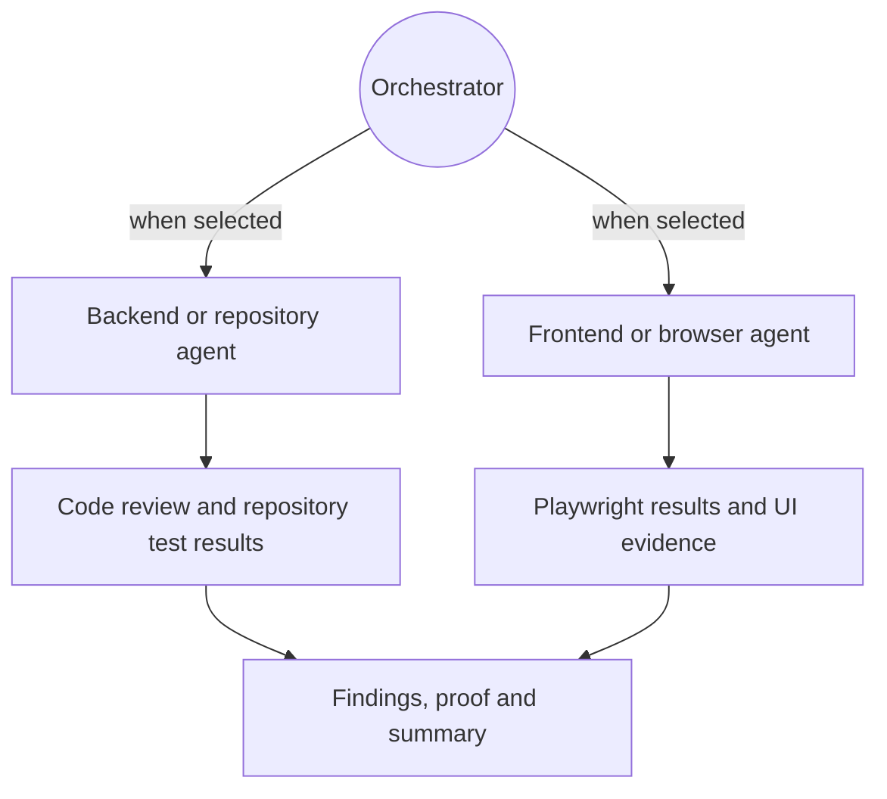

# Mandatory agentic QA orchestration

**Status:** Product design approved in conversation; implementation not authorized by this document alone.  
**Date:** 2026-09-29

## Problem and goal

The product should require a configured AI agent for every QA run. The agentic workflow ingests selected Azure DevOps Stories/Requirements, their Tasks, acceptance criteria, the selected repository snapshot and/or site, plans the QA work, delegates to appropriate specialist agents, creates and runs tests, reviews the resulting evidence, and produces a proof-linked summary.

The Orchestrator Agent decides what work is appropriate for the selected criteria and targets. A user approves the run scope, data context, target, cost/resource budget and permitted actions once. The agents then work autonomously inside that envelope. A request to exceed it pauses for user approval.

The app remains responsible for enforcing capability boundaries, validating agent plans and outputs, operating isolated workers, retaining evidence and applying the configured verdict policy. Agentic planning and execution are mandatory; local deterministic planning is not a fallback mode.

## Goals

- Make an agent mandatory for all QA runs; a run cannot start without an available configured provider/model.
- Interpret Requirements, acceptance criteria and related Tasks together while preserving their source IDs, fields and revisions.
- Map each criterion to appropriate backend/repository, frontend/browser or combined test work, including when UI functionality depends on an API.
- Delegate adaptively to specialists based on the approved plan and selected targets.
- Allow agents to inspect the approved repository snapshot, review code, draft tests, and execute approved repository tests in a disposable copy.
- Allow agents to generate and execute bounded Playwright checks against the approved site origin.
- Produce evidence-backed findings, summaries and a small plan-specific delegation diagram.
- Give each user practical provider/model configuration and hard limits against runaway cost or work.

## Non-goals

- Let agents change ADO work items, source branches, PRs, deployments or remote systems.
- Let an agent add execution capabilities, origins, secrets, budgets or verdict outcomes.
- Run repository code in the original working tree or expose host credentials to agents/workers.
- Treat Task completion as proof that a parent Requirement's acceptance criteria passed.
- Allow model assertions alone to establish a passing result.
- Require one fixed set of agent names. The plan can name specialists by the work assigned.

## User workflow

1. The user selects ADO Requirements/Stories and associated Tasks, repository and/or site, and test profile.
2. The configured Orchestrator reads the versioned source snapshots and available target/configuration metadata. It drafts a structured coverage and delegation plan, preserving criterion/Task provenance and flagging ambiguous or missing acceptance criteria.
3. The app presents the run envelope: provider/model, ADO fields and revisions, repository file scope, site origin, agent/tool permissions, command profile, resource limits and estimated cost. The user can remove context or stop.
4. The user approves the envelope once. Within it, the Orchestrator may invoke specialist agents and approved tools without per-action confirmation. Going beyond the approved context, site origin, command permissions or budget pauses the run.
5. Agents inspect and perform their assigned work. Repository changes and generated tests exist only in a disposable snapshot. Browser checks run only against the approved site and action budget.
6. A Reviewer Agent associates results with criteria, identifies gaps and recommends failure classifications. The report preserves raw observations and artifacts, summarizes conclusions with proof links, and computes the verdict from the configured evidence policy.
7. The user reviews the run report and may separately choose whether to export generated tests or summaries. No automatic source control or ADO write occurs.

## Agent topology and generated diagram

The Orchestrator Agent creates the work graph and selects specialist work based on criteria, tasks, targets and evidence needs. A Repository Agent may inspect code, review relevant changes, draft unit/integration/API tests, and run the approved repository test command. A Browser Agent may create and execute Playwright coverage. If both target types are selected, both branches may run and the plan may add an end-to-end UI-to-API scenario. A Reviewer Agent correlates results and identifies proof gaps. The agent names and number of specialists may vary by plan.

Every plan includes a small generated diagram. It has a single circular Orchestrator node at the top, arrows to the selected backend/frontend or other specialist agents, then arrows from those agents to their result types and summaries. The diagram is rendered from validated structured assignments, not free-form model-produced diagram source, so it depicts the same delegation the system dispatches. The report can include both planned and completed/blocked work.

## Planning and domain rules

- ADO adapter snapshots remain the source of truth for Requirements, acceptance criteria, Tasks and revisions. Agents can propose links between Tasks, criteria and likely code paths, but those links retain source references and uncertainty.
- Tasks inform implementation scope and testing approach; a Task does not prove its parent's acceptance criteria.
- Each source criterion maps to required test layers, scenarios, expected observations and evidence needs. Criteria without adequate proof remain unverified or blocked.
- Agent plans use a versioned structured schema. The Orchestrator can propose test files, test identities and worker actions, but cannot mutate the original source, accepted criteria, configured commands, allowed origins, user-set budget or verdict policy.
- The Orchestrator may revise/delegate within the approved plan envelope after learning from results. New work outside that envelope requires approval.

## Provider and model configuration

- AI configuration is required for every user who starts a run. Remove the deterministic local planning path as an alternative QA run mode.
- A user configures a provider connection and one default model. The searchable model picker shows models discovered from that provider where available, or the provider's supported catalog when discovery is unavailable. It filters models by required structured-output and tool-orchestration capabilities and shows provider/model identity.
- Optional per-role model overrides allow specialists to use different models. The default model is used by all roles when no override exists.
- Provider APIs require protocol-specific adapters; an arbitrary API key by itself is insufficient. A custom compatible endpoint may be supported only with an explicit adapter/protocol and approved destination origin. Provider credentials remain in protected local main-process storage and never enter renderer state, prompts, reports or workers.
- Claude subscription/plan-based sign-in is a separate connection type from an Anthropic API key. Support it only through an officially supported integration for third-party use; never reuse browser cookies or scrape a CLI credential cache as a substitute.
- Run manifests record provider, model, adapter version, configuration identity, reported usage and limits, without recording credentials.

## Cost and work limits

The user sets a shared per-run cost ceiling and token/resource limits. The coordinator enforces ceilings for input/output tokens, provider calls, agent count/fan-out, parallel work, retries, wall time, repository commands, browser actions and artifact size. Each planned provider request reserves a conservative estimated cost before dispatch, based on configured/current provider-model pricing and maximum token budgets. The run stops delegating when the next reservation would exceed the ceiling or pricing is unavailable. The app records provider-reported usage and its cost estimate; provider billing remains the authoritative charge. The setup view recommends lower-cost defaults and makes the budget visible before approval.

## Context, trust and execution boundaries

- Before approval, show which ADO fields/revisions, repository paths or file scope, site origin and configuration are available to each agent, and identify the provider that will receive them. Users can exclude context. Provider requests are restricted to the approved context envelope; expanding that envelope pauses the run.
- Treat ADO text, repository contents, webpages, test output and model output as untrusted data. Instructions embedded in these sources never grant permissions.
- Agents use an app-owned, typed tool catalog. A constrained tool broker checks every request against the approved run envelope. Models cannot add tools or directly access shell, filesystem, tokens or network.
- Repository inspection uses an immutable selected snapshot. Generated code/tests are written only into a disposable copy. Execution uses the reviewed project command profile and isolated worker; no model-generated shell string or executable/argument array is accepted as new authority.
- Browser execution uses an explicit approved origin, bounded actions and user-approved test-data scope. Secrets are injected by the coordinator at use time into the appropriate worker and are never model context.
- Credentials, raw provider payloads and sensitive artifacts are excluded from ordinary logs and exports. Retention and deletion controls remain local-first.
- Agents cannot set the verdict. The Reviewer Agent may classify and explain observations, but the report retains the source observations and applies the existing evidence/verdict policy.

## Results and error handling

Agents return structured results referencing run, criterion, scenario, agent, tool action and evidence identities. Evidence may include test case output, code review notes, Playwright assertions, screenshots/traces and command records. The summary links claims to this evidence. Results without direct support are unverified.

Distinguish at least product failure, test failure, environment failure, flaky test, ambiguous requirement, insufficient evidence and blocked execution. Preserve observations even if a reviewer or human changes a classification. A confirmed product failure is not erased by later cancellation. Partial results and the delegation diagram remain available after cancellation, budget exhaustion, provider error, worker failure or missing target. A retry creates a new immutable run manifest.

## Existing-document conflicts and recommended resolution

This design changes existing requirements and ADRs; they must be reconciled before implementation:

- `docs/00-agentic-qa-system-architecture.md` and `docs/spec/06-delivery-plan.md` describe optional OpenAI suggestions and deterministic local planning. Replace those with mandatory configured agent orchestration and the provider adapter/model capability contract.
- `docs/decisions/ADR-0002-optional-openai-scenario-suggestions.md` limits the first provider to OpenAI and its payload to browser acceptance-criteria text. Supersede it with a multi-provider, role-capability design and a run-level context/permission envelope.
- `docs/spec/01-product-requirements.md` places test generation in later FR-14 and describes AI as optional in FR-08. Re-sequence the required end-to-end agent planning, delegation, test generation/execution, evidence review and diagram in the first-release requirements and milestones.
- `docs/spec/04-security-privacy.md` requires per-request exact-payload approval and currently excludes repository files from provider context. Replace this with an explicit pre-run context/permission manifest and one-time run approval; requests must remain inside that approved envelope and pause when scope grows.
- Existing domain/verdict rules remain in force: tasks are context, every criterion requires direct evidence, and agents cannot manufacture PASS.

The recommended resolution is to keep the existing local-first, read-only ADO, disposable-worker and evidence-backed verdict constraints while replacing optional/deterministic planning with a mandatory agentic execution loop. Update the canonical requirements, architecture, security, UX and delivery plan before implementing dependent behavior.

## Acceptance criteria for implementation planning

- A run cannot start without a working configured provider and model.
- Given a UI plus API story, the plan can associate relevant Tasks and acceptance criteria with backend, frontend or combined checks, and shows the dynamic delegation diagram.
- The plan and generated diagram reflect actual dispatched assignments, including omitted, blocked and completed work.
- The user approves context and permissions once; an agent requiring work outside the envelope pauses for approval.
- Agents can inspect approved repository context, generate tests in a disposable copy, and run only reviewed commands in the constrained worker.
- Agents can generate and run Playwright checks only for the approved site origin and limits.
- Each result and summary claim links to direct evidence or is explicitly unverified.
- Provider credentials never enter renderer, prompt, log, report or worker context.
- Provider calls, tokens, cost estimate, agent fan-out, retries, wall time, actions and artifacts obey user-configured limits.
- Cancellation, provider failure, worker failure and budget exhaustion preserve partial results and cannot manufacture a passing verdict.
- Supported model discovery, unavailable provider/model, malformed agent output, prompt injection and unexpected provider usage have actionable failure behavior.

## Scope and milestone recommendation

This is a first-release architecture change, not a small M2 enhancement. Establish the provider-neutral agent protocol, capability broker, structured plan/result schemas, budget reservation, model discovery and threat model before broad agent execution. Then implement one end-to-end slice for combined UI/API QA, validate it against the existing M0 security gates, and expand supported providers/roles after the contract is stable. The existing M0 packaging, identity and isolation exit gates remain required; this design does not claim they are complete.
